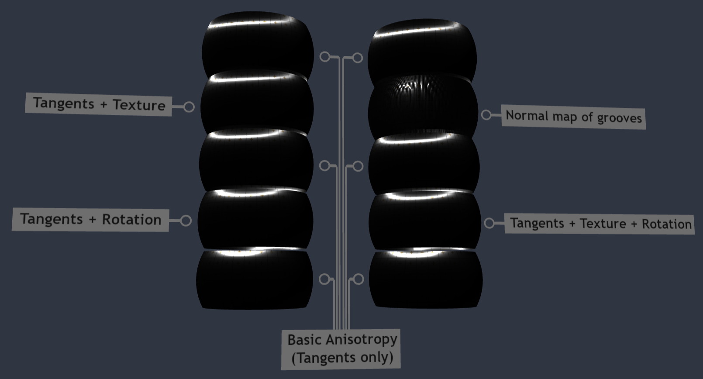

# Anisotropy Rotation Test

## Tags

[extension](../../Models-extension.md), [testing](../../Models-testing.md)

## Summary

This model tests rotational offsets for KHR_materials_anisotropy.

## Operations

* [Display](https://github.khronos.org/glTF-Sample-Viewer-Release/?model=https://raw.GithubUserContent.com/KhronosGroup/glTF-Sample-Assets/main/./Models/AnisotropyRotationTest/glTF-Binary/AnisotropyRotationTest.glb) in SampleViewer
* [Download GLB](https://raw.GithubUserContent.com/KhronosGroup/glTF-Sample-Assets/main/./Models/AnisotropyRotationTest/glTF-Binary/AnisotropyRotationTest.glb)
* [Model Directory](./)

## Screenshot

## Description

This model tests rotational offsets for [`KHR_materials_anisotropy`](https://github.com/KhronosGroup/glTF/tree/main/extensions/2.0/Khronos/KHR_materials_anisotropy).  It has the following features:

- Six of the meshes (2 on the bottom row, 2 in the middle, and 2 on the top row) are all "simple" anisotropy with material roughness extended horizontally along the mesh's `TANGENT` vectors.

- One mesh in the lower-left marked "Tangents + Rotation" has a 30-degree clockwise tilt to the `TANGENT` vectors, and un-does this rotation using the `anisotropyRotation` parameter in radians equivalent to 30 degrees counter-clockwise.  When the rotation is applied correctly, the anisotropy here should look the same as the neighboring meshes.

- One mesh in the upper-left marked "Tangents + Texture" has the same 30-degree clockwise tilt to the `TANGENT` vectors, and un-does this rotation using the `anisotropyTexture` parameter with a 30-degree counter-clockwise tilt encoded in the texture.  As before, when the rotation is applied correctly, the anisotropy here should look the same as the neighboring meshes.

- One mesh in the lower-right marked "Tangents + Texture + Rotation" has again the same 30-degree clockwise tilt to the `TANGENT` vectors as the others.  However this mesh uses a combination of 10 degrees from `anisotropyTexture` and 20 degrees (in radians) from `anisotropyRotation`, combining to create the 30-degree counter-clockwise tilt needed to make the anisotropy horizontal like the other meshes.

- Finally, one mesh in the upper-right marked "Normal map of grooves" has no anisotropy applied at all.  It has a (somewhat grainy) normal texture applied with a series of vertical grooves, intended to approximate the look of very coarse horizontal anisotropy.  It will not look exactly the same as its neighbors, but a bright light source in the environment should still spread out horizontally like its neighbors.

## Legal

&copy; 2023, Analytical Graphics, Inc.. [CC BY 4.0 International](https://creativecommons.org/licenses/by/4.0/legalcode)

 - Ed Mackey for Everything

#### Assembled by modelmetadata 1.1.16-beta