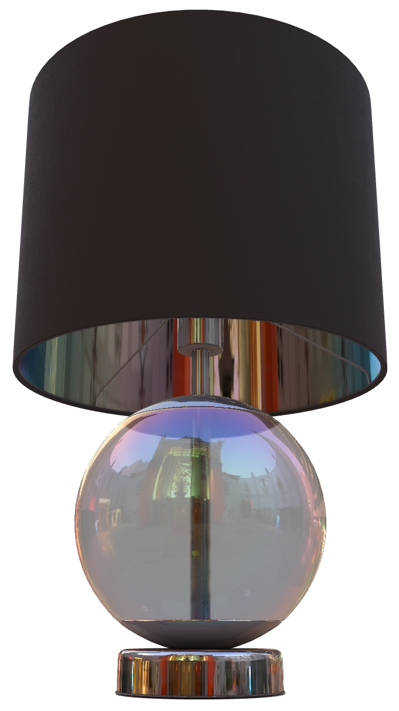
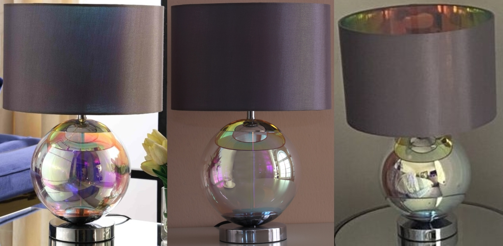
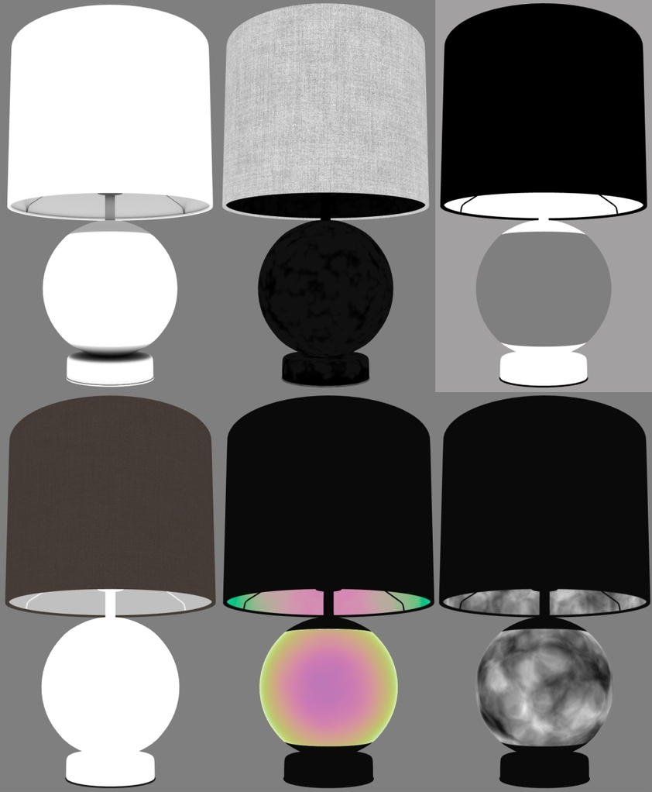

# Iridescence Lamp

## Tags

[showcase](../../Models-showcase.md), [extension](../../Models-extension.md)

## Extensions Used

* KHR_materials_transmission

* KHR_materials_volume

* KHR_materials_iridescence

## Summary

Wayfair Lamp model using transmission, volume, and KHR_materials_iridescence.

## Operations

* [Display](https://github.khronos.org/glTF-Sample-Viewer-Release/?model=https://raw.GithubUserContent.com/KhronosGroup/glTF-Sample-Assets/main/./Models/IridescenceLamp/glTF-Binary/IridescenceLamp.glb) in SampleViewer
* [Download GLB](https://raw.GithubUserContent.com/KhronosGroup/glTF-Sample-Assets/main/./Models/IridescenceLamp/glTF-Binary/IridescenceLamp.glb)
* [Model Directory](./)

## Screenshot

(above) [glTF Sample Viewer](https://github.khronos.org/glTF-Sample-Viewer-Release/) screenshot, with the Footprint Court IBL.

## Description

This model represents the real Wayfair product [Bonsell 19" Table Lamp](https://www.wayfair.com/lighting/pdp/wrought-studio-bonsell-19-table-lamp-w002337865.html) which has iridescent finishes. 

The use of real-world photographic reference is meant to help glTF developers with calibrating material features and renderer behavior, to more accurately represent e-commerce products. Additional photo reference is available on the Wayfair website.

(above) Photos of the real product.

## Materials

The glass material uses [KHR_materials_transmission](https://github.com/KhronosGroup/glTF/tree/master/extensions/2.0/Khronos/KHR_materials_transmission) and [KHR_materials_volume](https://github.com/KhronosGroup/glTF/tree/master/extensions/2.0/Khronos/KHR_materials_volume) for transmission and refraction, along with [KHR_materials_iridescence](https://github.com/KhronosGroup/glTF/pull/2027) for iridescence. 

The colors are caused by a type of glaze called [carnival glass](http://www.ddoty.com/newcomers.html). On the real product the glaze is applied to the inside of the glass cover rather than the outside. However because most rasterizers render only a single layer of transmission, the iridescent colors were applied to both inside and outside of the cover rather than only on the inside.

The glass uses partial Metalness to improve the iridescent response, because the glaze on carnival glass is partially metallic. If it were fully metallic, the glass would become entirely opaque.

The iridescence on the glass uses a thickness range from 395 to 405 nanometers and a thickness texture for surface variation, which seems to match the iridescent colors in the reference photography.

The inner surface of the lamp shade uses a fully-metallic material with iridescence. On the real product this surface is a partially-transmissive metal foil; however to optimize the rendering in glTF this material has been simplified to not utilize transmission. 

The iridescence on the lamp shade uses a thickness range from 485 to 515 nanometers and a thickness texture for surface variation, which seems to match the iridescent colors in the reference photography.

(above) Material ingredients for the model. Top row: occlusion, roughness, metalness. Bottom row: base color, iridescence, iridescence thickness.

## Creation Details

The asset was created using [3ds Max](https://www.autodesk.com/products/3ds-max), exported to glTF using [Max2Babylon](https://github.com/BabylonJS/Exporters#babylonjs-exporters), and materials were edited in [Visual Studio Code](https://code.visualstudio.com/) with [glTF Tools](https://github.com/AnalyticalGraphicsInc/gltf-vscode#gltf-tools-extension-for-visual-studio-code).

## Legal

&copy; 2022, Wayfair, LLC. [CC BY 4.0 International](https://creativecommons.org/licenses/by/4.0/legalcode)

 - Eric Chadwick for Everything

#### Assembled by modelmetadata